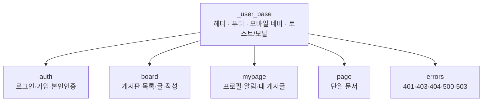

> **About this repository — customized copy / 커스터마이징 사본**
>
> This is **not** the official source. It is a customized copy of the `wc-community` user
> template for [Gnuboard7](https://sir.kr/), as installed and modified on one site.
> - **Original author**: (주)에스아이알소프트 (SIR Soft, `sirsoft`) — https://sirsoft.com
> - **Distribution**: shipped by SIR Soft as a Gnuboard7 user template (identifier `wc-community`,
>   vendor `sirsoft`). The documentation below and `LICENSE` are carried over from the original
>   package, which is based on the Gnuboard7 Basic template (`sirsoft-basic`).
> - **License**: MIT — the original copyright notice in [LICENSE](./LICENSE) is kept unchanged.
> - **Version**: `template.json` / `package.json` keep the original `1.0.0-beta.1`; local
>   customizations are tracked through this repository's commit history, not the version field.
> - **Build output (`dist/`) is committed**, `node_modules/` is not. A template update replaces the
>   whole active directory, and the bundled fonts cannot be reproduced by the build alone, so the
>   release archive has to carry them. `scripts/dist-repro-check.mjs` verifies that the committed
>   `dist/` still comes out of this source.
> - **Font Awesome is subsetted**: only the Solid face and only the icons listed in
>   `scripts/fa-icons.json` (143 names / 131 glyphs) ship, which takes `all.inlined.css` from 479 KB
>   down to 35 KB. `.fa-regular` / `.far` therefore render with the Solid face, and the Brands face is
>   dropped — nothing in the template draws a brand icon through it (the footer social links are
>   rendered with the Solid style class, so they were already blank). See
>   「동봉 자산과 아이콘 서브셋」 below before adding an icon.
> - **The home page carries no template blocks.** `layouts/home.json` keeps only the `main_content`
>   injection point; its content comes from [g7-home-widgets](https://github.com/William1607cho/g7-home-widgets).
>   Without that plugin the home page is empty apart from the header and footer.
> - **E-commerce is removed.** The shop, cart, order, mileage, wishlist and currency screens, routes,
>   translations and editor samples inherited from the Basic template are gone; `template.json` does
>   not depend on `sirsoft-ecommerce`. Text below that came from the original package has been
>   trimmed accordingly.
>
> 이 저장소는 sirsoft 가 배포한 `wc-community` 템플릿을 한 사이트에서 설치·수정해 온 **비공식 커스터마이징 사본**입니다.
> 원 저작권·MIT 라이선스 고지는 그대로 유지하며, 아래 문서는 원본 패키지(sirsoft-basic 기반)에 포함된 내용입니다.
> 버전 표기는 원본 `1.0.0-beta.1` 을 유지하고 커스터마이징 이력은 커밋 기록으로 관리합니다.
> **홈은 g7-home-widgets 가 주입하는 섹션만 표시합니다**(템플릿 블록 없음). 이커머스 화면·라우트·번역은 모두 뺐습니다.

---

# 그누보드7 Basic 템플릿

**그누보드7 템플릿 · sirsoft-basic**
그누보드7 기본 사용자 템플릿

<!-- @generated:badges START — ext:docgen 이 갱신. 이 블록 안은 직접 수정하지 않는다 -->
<p align="center">
  
  
  
  
  
  
  
</p>
<!-- @generated:badges END -->

---

[소개](#소개) · [주요 기능](#주요-기능) · [동작 방식](#동작-방식) · [요구 사항](#요구-사항) · [설치](#설치) · [제공 컴포넌트](#제공-컴포넌트) · [사용 방법](#사용-방법) · [다른 확장과의 연동](#다른-확장과의-연동) · [문서](#문서) · [트러블슈팅](#트러블슈팅) · [변경 이력](#변경-이력) · [라이선스](#라이선스)

---

## 소개

<!-- @intent START -->
방문자가 보는 **사이트 전체 화면**을 담당하는 커뮤니티용 사용자 템플릿입니다. 홈·게시판·
마이페이지·로그인·오류 화면이 모두 여기 들어 있습니다.

그누보드7 에서 게시판 모듈은 데이터와 관리자 화면을 담당하고, **방문자에게 보이는
모습은 템플릿이 정합니다.** 그래서 게시판의 디자인을 바꾸고 싶다면 그 모듈이 아니라
이 템플릿(또는 다른 사용자 템플릿)을 손봅니다.

다크 모드·반응형·다국어를 기본으로 지원합니다.

이 템플릿만으로는 동작하지 않습니다 — 게시판·페이지 모듈과 주소 검색 플러그인이
함께 설치·활성화되어 있어야 합니다.
<!-- @intent END -->

## 주요 기능

<!-- @intent START -->
| 영역 | 설명 |
|---|---|
| 홈·공통 | 헤더·푸터·모바일 네비게이션, 통합 검색, 알림 센터, 다크/라이트 전환 |
| 인증 | 로그인·회원가입·비밀번호 찾기/재설정·본인인증 화면, 소셜 로그인 버튼 |
| 게시판 | 게시판 목록·글 목록·글 보기·글쓰기, 인기글, 게시판 유형별 표시 |
| 마이페이지 | 프로필·비밀번호 변경·알림·내 게시글 |
| 단일 문서 | 회사소개·약관 같은 페이지 표시 |
| 오류 화면 | 401·403·404·500·503·점검 중 |
| 다국어 | 한국어·영어 번역 (헤더·모바일 메뉴의 언어 선택은 숨김) |
| 반응형·다크 모드 | 모바일/데스크톱 레이아웃 분기, 시스템 설정 연동 테마 |
<!-- @intent END -->

## 동작 방식

<!-- @intent START -->


모든 화면이 하나의 베이스를 물려받습니다. 헤더·푸터·모바일 메뉴와 알림 표시가 그 베이스에
있어, 사이트 전체의 공통 요소를 한 곳에서 바꿀 수 있습니다.


화면은 이 템플릿이 그리고 데이터는 모듈이 제공합니다. 그래서 템플릿을 바꿔도 게시글이나
회원 데이터는 그대로 남습니다.
<!-- @intent END -->

## 요구 사항

<!-- @generated:requirements START — ext:docgen 이 갱신. 이 블록 안은 직접 수정하지 않는다 -->
| 항목 | 값 |
|---|---|
| 그누보드7 코어 | `>=7.0.11` |
| PHP | `^8.2` |
| 의존 모듈 | `sirsoft-board` `>=1.0.0` |
| 의존 모듈 | `sirsoft-page` `>=1.1.0` |
| 의존 플러그인 | `sirsoft-daum_postcode` `>=1.0.0` |
<!-- @generated:requirements END -->

## 설치

<!-- @generated:install START — ext:docgen 이 갱신. 이 블록 안은 직접 수정하지 않는다 -->
```bash
# 번들 설치 (코어에 동봉된 소스에서 설치)
php artisan template:install sirsoft-basic

# 활성화
php artisan template:activate sirsoft-basic

# 업데이트 (번들 소스 기준 강제 반영)
php artisan template:update sirsoft-basic --force
```

저장소: https://github.com/gnuboard/g7-template-sirsoft-basic
<!-- @generated:install END -->

## 제공 컴포넌트

<!-- @generated:settings-summary START — ext:docgen 이 갱신. 이 블록 안은 직접 수정하지 않는다 -->
컴포넌트 79개 (루트: `src/components`).

| 분류 | 개수 |
|---|---|
| `basic` | 38개 |
| `composite` | 36개 |
| `layout` | 5개 |
<!-- @generated:settings-summary END -->

<!-- @intent START -->
위 개수는 이 템플릿이 화면을 그리는 데 쓰는 **부품**의 수입니다. 운영자가 직접 다룰 일은
없지만, 화면을 직접 손보거나 확장을 붙일 때는 **여기 있는 부품만 쓸 수 있습니다** — 목록에 없는
부품을 쓴 화면 조각은 이 템플릿에서 렌더되지 않습니다.

관리자 템플릿(`sirsoft-admin_basic`)과는 구성이 다릅니다. 표·필터·다국어 입력 같은 관리 도구가
없고, 대신 이미지 갤러리·게시글 반응·모바일 메뉴·소셜 로그인처럼 **방문자
화면에 필요한 것들**이 있습니다.

전체 목록과 각 부품의 사용법은 [docs/components.md](docs/components.md) 에 있습니다.
<!-- @intent END -->

## 사용 방법

<!-- @intent START -->
**도입**: 템플릿을 설치·활성화하면 사이트의 방문자 화면이 이 템플릿으로 바뀝니다. 게시판·
페이지 모듈과 주소 검색 플러그인이 함께 활성화되어 있어야 모든 화면이 정상 동작합니다.
홈 화면 내용은 g7-home-widgets 플러그인이 채웁니다.

**색상·문구 손보기**: 화면 구성은 레이아웃 파일(JSON)이 정하고 부품 모양은 컴포넌트가
정합니다. 레이아웃만 고치는 변경(문구·배치·표시 항목)은 다시 빌드할 필요 없이
`php artisan template:update sirsoft-basic --force` 로 반영됩니다.

**다른 템플릿으로 교체**: 이 템플릿은 화면만 담당하므로, 다른 사용자 템플릿으로 바꿔도
게시글·회원 데이터는 그대로입니다.
<!-- @intent END -->

## 다른 확장과의 연동

<!-- @generated:integrations START — ext:docgen 이 갱신. 이 블록 안은 직접 수정하지 않는다 -->
**이 확장이 의존하는 확장**

| 확장 | 유형 | 버전 제약 | 번들 |
|---|---|---|---|
| `sirsoft-board` | 모듈 | `>=1.0.0` | ✅ |
| `sirsoft-page` | 모듈 | `>=1.1.0` | ✅ |
| `sirsoft-daum_postcode` | 플러그인 | `>=1.0.0` | ✅ |

**이 확장에 의존하는 확장** (이 확장을 비활성화하면 함께 영향을 받습니다)

없음.
<!-- @generated:integrations END -->

## 문서

<!-- @generated:docs-index START — ext:docgen 이 갱신. 이 블록 안은 직접 수정하지 않는다 -->
| 문서 | 내용 | 상태 |
|---|---|---|
| [docs/README.md](docs/README.md) | 문서 통합 목차와 실측 집계 | ✅ |
| [docs/architecture.md](docs/architecture.md) | 설계 의도·계층 지도·디렉토리 맵 | ✅ |
| [docs/components.md](docs/components.md) | 템플릿이 제공하는 컴포넌트 | ✅ |
| [docs/layouts.md](docs/layouts.md) | 레이아웃 목록과 라우트 매핑 | ✅ |
| [docs/handlers.md](docs/handlers.md) | 템플릿 전용 핸들러와 부트스트랩 | ✅ |
| [docs/editor-spec.md](docs/editor-spec.md) | 레이아웃 편집기에 선언한 팔레트·컨트롤·샘플 데이터 | ✅ |
| [CHANGELOG.md](CHANGELOG.md) | 변경 이력 | ✅ |
<!-- @generated:docs-index END -->

## 트러블슈팅

<!-- @intent START -->
| 증상 | 원인 | 조치 |
|---|---|---|
| 홈 화면이 비어 있음 | g7-home-widgets 플러그인이 비활성 | 플러그인 활성화를 확인합니다 — 홈 내용은 그 플러그인이 채웁니다 |
| 게시판 메뉴는 보이는데 글 목록이 안 나옴 | 게시판 모듈이 비활성이거나 그 게시판의 접근 권한이 제한됨 | 모듈 활성화와 게시판별 권한 설정을 확인합니다 |
| 주소 검색 버튼이 없거나 눌러도 반응이 없음 | 주소 검색 플러그인이 비활성이거나 외부 접속이 차단됨 | 플러그인 활성화를 확인합니다. 검색을 불러오지 못하면 주소를 직접 입력할 수 있습니다 |
| 알림 메시지나 팝업이 뜨지 않음 | 그 화면이 공통 베이스를 쓰지 않음 | 직접 추가한 화면이라면 공통 베이스를 상속하도록 고칩니다 |
| 검색엔진 노출 화면에 일부 글자가 빠짐 | 새 부품이 쓰는 항목이 검색엔진용 렌더 설정에 없음 | `seo-config.json` 의 텍스트 항목 목록을 확인합니다 |
| 화면 일부의 여백·색이 어긋남 | 새로 쓴 스타일 클래스가 빌드된 CSS 에 없음 | 기존 화면에서 쓰이던 클래스인지 확인하고, 필요하면 템플릿을 다시 빌드합니다 |
<!-- @intent END -->

## 동봉 자산과 아이콘 서브셋 (커스터마이징 사본 전용)

> 이 절은 원본 패키지에 없는, 이 사본에서만 쓰는 절차입니다.

### 왜 `dist/` 를 커밋하는가

템플릿 업데이트는 활성 디렉토리를 **통째로 갈아끼운다**(보존되는 것은 `custom/` 뿐이다).
그래서 릴리스 zip 에 없는 파일은 업데이트한 사이트에서 그대로 사라진다. 동봉 폰트
(서브셋 Font Awesome · Pretendard)는 `npm run build` 로 재현되지 않으므로 — Pretendard 는
생성 스크립트도 패키지도 없이 코어 번들에서 가져온 파일이다 — `dist/` 를 커밋하지 않으면
그 zip 으로 업데이트한 사이트에서 아이콘과 글꼴이 없어진다. 실제로 그렇게 만든 패키지로
설치한 사이트에서 폰트 2종이 빠진 적이 있다.

대신 "커밋된 산출물이 정말 이 소스에서 나온 것인가"를 확인할 방법이 필요하므로
`scripts/dist-repro-check.mjs` 가 임시 경로에 다시 빌드해 해시로 대조한다. 빌드가 만들지 않는
`dist/vendor/` 는 `scripts/vendor-manifest.json` 에 적힌 sha256 과 대조한다.

### 아이콘 서브셋

동봉 Font Awesome 은 `scripts/fa-icons.json` 에 적힌 이름만 담은 **Solid 전용 서브셋**이다
(143종 / 고유 글리프 131개). 이 목록이 단일 원본이고, 서브셋 폰트와 레이아웃 편집기의 아이콘
선택기 목록이 모두 여기서 만들어진다.

- `all.inlined.css` 479,299 B → 35,894 B (gzip 311 KB → 16 KB). 렌더 차단 CSS 라 첫 화면 표시에
  바로 영향을 준다.
- 폰트는 계속 `data:` URI 로 인라인한다. 자산 URL 이 `?file=` 쿼리가 되는 구성에서는 CSS 안의
  상대 `url()` 이 풀리지 않아 아이콘이 통째로 사라지기 때문이다.
- **의도된 차이**: `.fa-regular` / `.far` 는 Regular 페이스가 없어 Solid 모양으로 보인다.
  Brands 페이스와 구버전 호환 패밀리(`Font Awesome 5 …` · `FontAwesome`)는 제거됐다.
- 수식어·유틸리티 규칙(`fa-spin` · `fa-fw` · `fa-2x` · `fa-ul` · `fa-rotate-90` 등)은 전부 남아 있다.
- **재현성**: 같은 목록으로 다시 생성해도 폰트 바이트(따라서 `all.inlined.css` 해시)는 매번 달라진다.
  fontTools 가 저장할 때 `head.modified` 에 생성 시각을 넣기 때문이다. 내용이 같은지는 두 woff2 를
  fontTools 로 열어 `head.modified` 를 뺀 나머지 테이블을 비교해 확인한다(CSS 규칙은 그대로 같다).
  커밋된 해시는 `scripts/vendor-manifest.json` 에 적힌 마지막 생성본 기준이다.

### 스크립트

도구 버전은 `scripts/vendor-manifest.json` 에 고정돼 있다. 호스트에 아무것도 설치하지 않도록
아래처럼 일회용 컨테이너에서 돌린다(저장소 폴더에서 실행).

```bash
# 1) 의존성
docker run --rm --user "$(id -u):$(id -g)" -e HOME=/tmp -v "$PWD":/w -w /w \
  node:22-bookworm-slim npm ci

# 2) Font Awesome 서브셋 생성 (fa-icons.json → dist/vendor/font-awesome/6.4.0/css/all.inlined.css)
docker run --rm --user "$(id -u):$(id -g)" -e HOME=/tmp -v "$PWD":/w -w /w python:3.12-slim sh -c '
  pip install --quiet --target /tmp/py fonttools==4.59.0 brotli==1.1.0 &&
  PYTHONPATH=/tmp/py python3 scripts/fa-subset.py \
    node_modules/@fortawesome/fontawesome-free/css/all.min.css \
    node_modules/@fortawesome/fontawesome-free/webfonts/fa-solid-900.woff2 \
    scripts/fa-icons.json \
    dist/vendor/font-awesome/6.4.0/css/all.inlined.css'

# 3) 편집기 아이콘 선택기 목록 재생성 + 대조
docker run --rm --user "$(id -u):$(id -g)" -e HOME=/tmp -v "$PWD":/w -w /w \
  node:22-bookworm-slim sh -c 'node scripts/fa-controls-sync.mjs && node scripts/fa-icons-check.mjs'

# 4) 빌드 (배포용은 소스맵을 만들지 않는다)
docker run --rm --user "$(id -u):$(id -g)" -e HOME=/tmp -e G7_BUILD_SOURCEMAP=0 -v "$PWD":/w -w /w \
  node:22-bookworm-slim sh -c 'npm run vendor:browser-image-compression && npm run build'

# 5) 커밋된 dist 가 이 소스에서 재현되는지 확인 (오래 걸린다 — npm ci 를 한 번 더 한다)
docker run --rm --user "$(id -u):$(id -g)" -e HOME=/tmp -v "$PWD":/w -w /w \
  node:22-bookworm-slim node scripts/dist-repro-check.mjs
```

| 스크립트 | 하는 일 |
|---|---|
| `scripts/fa-icons.json` | 서브셋에 넣을 아이콘 목록 (이름 → 코드포인트·출처). **단일 원본** |
| `scripts/fa-subset.py` | 목록대로 Solid woff2 를 서브셋해 `all.inlined.css` 를 만든다 (`npm run vendor:font-awesome`) |
| `scripts/fa-controls-sync.mjs` | `editor-spec/controls.json` 의 아이콘 선택기 목록을 목록에서 다시 만든다 (`--check` 는 대조만) |
| `scripts/fa-icons-check.mjs` | 저장소가 쓰는 아이콘이 목록 안에 있는지, 선택기 목록이 목록과 같은지 대조 |
| `scripts/dist-repro-check.mjs` | 커밋된 `dist/` 를 재빌드 결과·`vendor-manifest.json` 과 해시 대조 |
| `scripts/vendor-copy.mjs` | `browser-image-compression` 동봉본 복사 |
| `scripts/vendor-manifest.json` | 입력 원본(버전·해시)과 도구·이미지 버전, `dist/vendor/` 파일 해시 |

`scripts/` 와 테스트 폴더는 `.gitattributes` 의 `export-ignore` 로 릴리스 아카이브에서 빠진다.

### 아이콘 추가 절차

목록에 없는 아이콘을 쓰면 화면에서 **빈 칸**이 된다 — 콘솔 오류도 404 도 나지 않으므로 화면만
봐서는 원인을 알 수 없다. 그래서 순서를 지킨다.

1. `scripts/fa-icons.json` 의 `icons` 에 `"이름": { "codepoint": "f0xx", "sources": "…" }` 를 추가한다
   (이름 오름차순). 코드포인트는 `node_modules/@fortawesome/fontawesome-free/css/all.min.css` 의
   `.fa-<이름>:before{content:"\f0xx"}` 에서 그대로 가져온다. 값이 틀리면 생성기가 중단한다.
2. 위 2) 3) 4) 를 다시 돌린다 (서브셋 → 선택기 → 빌드).
3. `node scripts/fa-icons-check.mjs` 가 통과하는지 확인한다.
4. `dist/` 변경분과 함께 커밋한다.

Brands 아이콘(github · x 등)은 이 서브셋에 없다. 쓰려면 Brands 페이스를 되살려야 하므로
`scripts/fa-subset.py` 를 고치는 별도 작업이다.

사이트 DB 에만 있는 아이콘도 있다는 점에 주의한다 — 상단 메뉴 아이콘은 `g7-easy-topmenu`
플러그인의 항목에 저장되고, 그 선택지 64종은 목록에 미리 넣어 두었다. 저장소만 봐서는
확인할 수 없으므로 `fa-icons-check.mjs` 는 "쓰는데 목록에 없는" 경우만 실패로 본다.

## 테스트 (커스터마이징 사본 전용)

```bash
npm ci
npx vitest run
```

- 이 저장소만으로 돈다. 셋업은 `tests/vitest.setup.ts`, DOM 환경은 `happy-dom`(패키지에 포함).
  외부 네트워크는 쓰지 않는다.
- **코어 의존 테스트**: 코어 렌더 엔진(`@/core/…`·`@core/…`)을 불러오는 레이아웃 렌더 테스트(16개,
  `src/__tests__/layouts/*` 등)는 그누보드7 코어 소스와 코어의 npm 의존성이 있어야 돈다.
  `G7_ROOT=<코어 루트> npx vitest run` 처럼 코어 루트(`artisan` 이 있는 곳, `npm ci` 를 마친 곳)를
  주면 함께 돌고, 없으면 제외된다(실행 시 제외 사유를 한 줄 알린다). 이 테스트들은 `jsdom` 환경을
  쓰는데, `jsdom` 은 코어 쪽 의존성이다.
- **알려진 실패** (단독 실행, 2026-09-26 기준 — 이번 디자인 변경과 무관):
  - `src/components/composite/__tests__/HtmlContent.test.tsx` 9건 — `happy-dom` 의 DOM 파서가 브라우저와
    달라 정화 결과가 다르게 나온다. 같은 DOMPurify·같은 설정을 실제 크로미엄에서 돌리면 모두 기대대로
    동작한다(원래 `jsdom` 에서 돌던 테스트).
- Playwright(`tests/Playwright`)는 실행 중인 사이트가 필요하다(`PLAYWRIGHT_BASE_URL`).

## 변경 이력

[CHANGELOG.md](CHANGELOG.md)

## 라이선스

MIT
